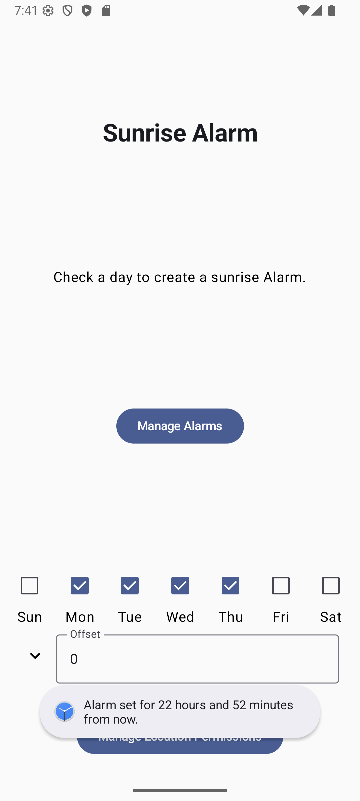

# SunriseAlarm

SunriseAppNew is an Android application that allows users to set alarms for sunrise times on selected days of the week, with customizable time offsets. The app uses the device's location to calculate accurate sunrise times and leverages the [SunriseSunsetCalculator](https://github.com/mikereedell/sunrisesunsetlib-java) library for astronomical calculations.

## Features

- **Sunrise Alarms:** Set alarms to trigger at sunrise for any day(s) of the week.
- **Custom Time Offset:** Adjust the alarm to go off before or after the actual sunrise time.
- **Location Awareness:** Automatically fetches the device's current location to calculate precise sunrise times.
- **Permission Management:** Easy access to manage location permissions from within the app.
- **Alarm Management:** Quick access to view and manage all alarms on the device.

## Screenshots



## Getting Started

### Prerequisites

- Android Studio (or compatible IDE)
- Android device or emulator (API 24+)
- Internet connection for dependency downloads

### Building the Project

1. **Clone the repository:**
   ```sh
   git clone https://github.com/tgrozenski/SunriseAlarm
   ```

2. **Open in Android Studio:**  
   Open the project folder in Android Studio.

3. **Build the project:**  
   The project uses Gradle for build automation. Dependencies are managed via the [libs.versions.toml](gradle/libs.versions.toml) file.

   You can also build from the command line:
   ```sh
   ./gradlew build
   ```

4. **Run the app:**  
   Deploy to an emulator or a physical device.

### Permissions

The app requires the following permissions:
- `ACCESS_FINE_LOCATION` and `ACCESS_COARSE_LOCATION` for location-based sunrise calculations.
- `SET_ALARM` and `MANAGE_ALARM` to create and manage alarms.

These permissions are requested at runtime.

## Usage

1. **Select Days:**  
   Choose the days of the week you want a sunrise alarm.

2. **Adjust Offset:**  
   Use the offset input to set how many minutes before or after sunrise the alarm should trigger.

3. **Sync Location:**  
   The app will automatically fetch your location. If permissions are missing, use the "Manage Location Permissions" button.

4. **Manage Alarms:**  
   Use the "Manage Alarms" button to view or edit all alarms on your device.

## Project Structure

The project uses the MVVM architectural pattern for clear separation of concern for components.

- [`app/src/main/java/com/example/sunriseappnew/`](app/src/main/java/com/example/sunriseappnew/): Main application source code.
  - [`MainActivity.kt`](app/src/main/java/com/example/sunriseappnew/MainActivity.kt): Main entry point and UI composition.
  - [`viewmodel/ViewModel.kt`](app/src/main/java/com/example/sunriseappnew/viewmodel/ViewModel.kt): App state and business logic.
  - [`model/LocationService.java`](app/src/main/java/com/example/sunriseappnew/model/LocationService.java): Location and sunrise calculation logic.
  - [`model/AlarmUtils.kt`](app/src/main/java/com/example/sunriseappnew/model/AlarmUtils.kt): Alarm intent utilities.
  - [`view/`](app/src/main/java/com/example/sunriseappnew/view/): Jetpack Compose UI components.
- [`app/src/main/res/`](app/src/main/res/): Resources (layouts, drawables, strings, etc.)
- [`gradle/libs.versions.toml`](gradle/libs.versions.toml): Centralized dependency versions.

## Dependencies

- [AndroidX Compose](https://developer.android.com/jetpack/compose)
- [SunriseSunsetCalculator](https://github.com/mikereedell/sunrisesunsetlib-java)
- [Google Play Services Location](https://developer.android.com/training/location)
- [Kotlin Coroutines](https://github.com/Kotlin/kotlinx.coroutines)

## Testing

Unit and instrumented tests are located in:
- [`app/src/test/java/`](app/src/test/java/)
- [`app/src/androidTest/java/`](app/src/androidTest/java/)

Run tests via Android Studio or with:
```sh
./gradlew test
./gradlew connectedAndroidTest
```

## License

This project is licensed under the Apache License 2.0. See [LICENSE](LICENSE) for details.

---